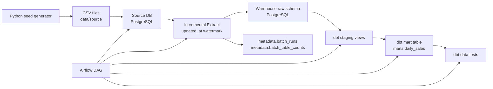

# Ecommerce Batch Data Pipeline

패션 커머스 도메인을 가정한 이커머스 배치 데이터 파이프라인 프로젝트입니다.

운영 DB에 쌓이는 주문/상품/고객/환불 데이터를 일 단위 배치로 분석 DB에 적재하고, dbt로 일별 매출 마트를 생성한 뒤 Airflow DAG로 전체 흐름을 오케스트레이션합니다.

## Project Goal

이 프로젝트의 목표는 단순 SQL 집계가 아니라, 배치 데이터 파이프라인의 전체 흐름을 로컬 환경에서 재현하는 것입니다.

```text
source PostgreSQL
→ updated_at incremental load
→ warehouse PostgreSQL raw
→ batch metadata / row count reconciliation
→ dbt staging
→ dbt marts.daily_sales
→ dbt tests
→ Airflow orchestration
```

핵심 산출물은 `marts.daily_sales`입니다.

```text
sales_date
order_count
gross_sales
refund_count
refund_amount
net_sales
average_order_amount
```

## Tech Stack

```text
Python
PostgreSQL
Docker Compose
dbt-postgres
Apache Airflow
```

## Architecture



## Data Model

Source DB는 패션 커머스 운영 DB를 단순화한 구조입니다.

```text
customers 1 ── N orders
orders 1 ── N order_items
products 1 ── N order_items
order_items 1 ── 0..1 refunds
```

주요 테이블:

```text
customers
products
orders
order_items
refunds
```

환불은 주문 전체가 아니라 `order_item` 단위로 발생하도록 설계했습니다. 패션 커머스에서는 한 주문에 여러 상품이 포함되고, 그중 일부 상품만 반품/환불되는 경우가 자연스럽기 때문입니다.

## Generated Dataset

`scripts/generate_seed_data.py`로 모의 데이터를 생성합니다.

```text
customers: 1,000
products: 300
orders: 10,000
order_items: 약 16,000
refunds: 500
period: 최근 90일
```

데이터 생성 시 반영한 가정:

```text
고객 등급은 bronze/silver/gold/vip 피라미드 분포
주말과 세일 기간에 주문 가중치 증가
인기 카테고리와 인기 브랜드 가중치 반영
환불 사유는 size_issue 비중을 높게 설정
환불 발생 시 orders.updated_at과 order_status 변경
```

## Warehouse Layers

Warehouse DB는 세 개의 schema로 나눴습니다.

```text
raw
staging
marts
metadata
```

`raw` 계층은 source DB에서 추출한 데이터를 거의 그대로 적재합니다. 각 raw 테이블에는 배치 적재 시점을 남기기 위해 `loaded_at` 컬럼을 추가했습니다.

`metadata` 계층은 배치 운영 정보를 저장합니다.

```text
metadata.batch_runs
metadata.batch_table_counts
```

`batch_runs`는 batch별 watermark, 실행 상태, 시작/종료 시각, 전체 row count, 오류 메시지를 저장합니다.

`batch_table_counts`는 테이블별 source 추출 건수와 warehouse 적재 건수를 저장해 row count reconciliation에 사용합니다.

`staging` 계층은 dbt view로 구성했습니다.

```text
staging.stg_customers
staging.stg_products
staging.stg_orders
staging.stg_order_items
staging.stg_refunds
```

`marts` 계층은 분석용 테이블입니다.

```text
marts.daily_sales
```

## Daily Sales Logic

`daily_sales`는 주문 발생일과 환불 발생일을 각각 집계한 뒤 날짜 기준으로 합칩니다.

```text
gross_sales = order_datetime 기준 주문 금액 합계
refund_amount = refund_datetime 기준 환불 금액 합계
net_sales = gross_sales - refund_amount
```

환불은 주문일이 아니라 실제 환불 발생일에 차감합니다. 이 방식은 일별 운영 리포트에서 “그날 발생한 주문과 환불 흐름”을 보기 좋습니다.

## Data Quality Tests

dbt test로 기본 품질 검증과 비즈니스 규칙 검증을 수행합니다.

현재 전체 테스트 수:

```text
40 tests passed
```

검증 항목 예시:

```text
primary key 컬럼 not_null / unique
customer_id, order_id, product_id relationships
order_status accepted_values
payment_method accepted_values
refund_reason accepted_values
daily_sales.sales_date unique
net_sales = gross_sales - refund_amount
refund_amount <= order_items.item_total_amount
```

## Airflow DAG

Airflow DAG 이름:

```text
daily_ecommerce_batch
```

스케줄:

```text
매일 02:00
```

Task 흐름:

```text
load_source_data
→ incremental_load_source_to_raw
→ dbt_run_staging
→ dbt_test_staging
→ dbt_run_marts
→ dbt_test_marts
```

`max_active_runs=1`, `max_active_tasks=1`로 설정해 같은 테이블을 truncate/load하는 배치 작업이 동시에 실행되지 않도록 했습니다.

`incremental_load_source_to_raw`는 마지막 성공 batch의 `watermark_end` 이후 변경된 row만 추출합니다.

```text
updated_at > watermark_start
updated_at <= watermark_end
```

각 테이블은 임시 load 테이블에 먼저 적재한 뒤 PK 기준으로 기존 raw row를 삭제하고 새 row를 insert합니다. 이 방식으로 같은 batch를 재실행해도 중복 row가 생기지 않도록 했습니다.

## Operational Enhancements

초기 구현은 source 데이터를 warehouse raw에 전체 재적재하는 full load 방식이었습니다. 이후 운영형 배치 파이프라인에 가깝게 만들기 위해 아래 항목을 보강했습니다.

```text
1. updated_at watermark 기반 증분 적재
2. batch 실행 이력 저장
3. 테이블별 row count reconciliation
4. Airflow retry / timeout / 동시 실행 제어
```

### Incremental Load

증분 적재는 마지막 성공 batch 이후 변경된 row만 source DB에서 추출합니다.

```sql
where updated_at > watermark_start
  and updated_at <= watermark_end
```

`created_at`이 아니라 `updated_at`을 기준으로 삼은 이유는 주문 상태 변경과 환불 반영 때문입니다. 예를 들어 과거에 생성된 주문이 나중에 `partially_refunded` 또는 `refunded` 상태로 바뀌면 `created_at`은 그대로지만 `updated_at`은 변경됩니다.

### Batch Metadata

`metadata.batch_runs`는 DAG 실행 단위의 운영 정보를 저장합니다.

```text
batch_id
dag_id
run_id
load_type
status
watermark_start
watermark_end
started_at
finished_at
source_row_count
target_row_count
error_message
```

`metadata.batch_table_counts`는 테이블별 검증 정보를 저장합니다.

```text
batch_id
table_name
source_row_count
target_row_count
status
```

이 구조 덕분에 장애가 발생했을 때 어떤 batch가 실패했는지, 어느 시간 구간을 처리하다 실패했는지, 어떤 테이블에서 source/target row count가 맞지 않았는지 확인할 수 있습니다.

### Row Count Reconciliation

각 테이블은 source에서 추출한 row 수와 warehouse raw에 적재한 row 수를 비교합니다.

```text
source_row_count == target_row_count → success
source_row_count != target_row_count → failed
```

row count가 맞지 않으면 `metadata.batch_runs.status`를 `failed`로 기록하고 Airflow task를 실패시킵니다. 즉 task가 에러 없이 끝났더라도 데이터 건수가 맞지 않으면 성공으로 처리하지 않습니다.

### Re-run Safety

증분 row는 raw 테이블에 바로 append하지 않습니다.

```text
1. raw._load_* 임시 테이블 생성
2. source 변경분을 임시 테이블에 COPY
3. raw 대상 테이블에서 같은 PK row 삭제
4. 임시 테이블 데이터를 raw 대상 테이블에 insert
5. 임시 테이블 삭제
```

이 방식은 같은 batch를 재실행해도 같은 primary key의 row가 중복으로 쌓이지 않게 하기 위한 설계입니다.

## Failure Handling Scenarios

운영 중 발생할 수 있는 대표 장애와 대응 방식입니다.

```text
source DB 연결 실패
→ Airflow retry 수행
→ 재시도 후에도 실패하면 task failed

incremental load 중 row count mismatch
→ metadata.batch_table_counts에 failed 기록
→ metadata.batch_runs.status = failed
→ DAG 실패 처리

dbt test 실패
→ 변환 결과의 품질 문제가 있다고 판단
→ marts 결과를 신뢰하지 않고 DAG 실패 처리

DAG 중복 실행 위험
→ max_active_runs=1, max_active_tasks=1로 동시 실행 차단

장시간 task hang
→ execution_timeout=10분으로 task 강제 실패 처리
```

최신 검증 기준으로 Airflow manual run은 성공했고, dbt test는 `PASS=40 WARN=0 ERROR=0` 상태입니다.

## How To Run

### 1. Generate Seed Data

```bash
python3 scripts/generate_seed_data.py
```

생성 결과:

```text
data/source/customers.csv
data/source/products.csv
data/source/orders.csv
data/source/order_items.csv
data/source/refunds.csv
```

### 2. Start Databases

```bash
docker compose up -d source-db warehouse-db
```

source DB 테이블 확인:

```bash
docker exec ecommerce-source-db psql -U source_user -d ecommerce_source -c "\dt"
```

warehouse DB schema 확인:

```bash
docker exec ecommerce-warehouse-db psql -U warehouse_user -d ecommerce_warehouse -c "\dn"
docker exec ecommerce-warehouse-db psql -U warehouse_user -d ecommerce_warehouse -c "\dt raw.*"
```

### 3. Load Source DB

```bash
python3 scripts/load_source_data.py
```

### 4. Incremental Load Source To Warehouse Raw

Airflow 환경에서는 incremental load 스크립트를 사용합니다.

```bash
docker compose exec airflow-scheduler \
  python /opt/airflow/project/scripts/airflow_incremental_load_source_to_raw.py
```

로컬에서 전체 적재를 수동으로 검증하고 싶을 때는 full load 스크립트를 사용할 수 있습니다.

```bash
python3 scripts/full_load_source_to_raw.py
```

### 5. Run dbt

```bash
cd dbt
dbt run --profiles-dir .
dbt test --profiles-dir .
```

### 6. Start Airflow

```bash
docker compose build airflow-init
docker compose up -d airflow-db airflow-init airflow-webserver airflow-scheduler
```

Airflow UI:

```text
http://localhost:8080
username: airflow
password: airflow
```

DAG 실행:

```bash
docker compose exec airflow-scheduler airflow dags unpause daily_ecommerce_batch
docker compose exec airflow-scheduler airflow dags trigger daily_ecommerce_batch
```

실행 상태 확인:

```bash
docker compose exec airflow-scheduler airflow dags list-runs -d daily_ecommerce_batch
docker compose exec airflow-scheduler airflow tasks states-for-dag-run daily_ecommerce_batch <run_id>
```

batch metadata 확인:

```bash
docker exec ecommerce-warehouse-db psql -U warehouse_user -d ecommerce_warehouse -c "select * from metadata.batch_runs order by started_at desc limit 5;"
docker exec ecommerce-warehouse-db psql -U warehouse_user -d ecommerce_warehouse -c "select * from metadata.batch_table_counts order by created_at desc limit 10;"
```

## Current Status

1차 배치 파이프라인은 완료된 상태입니다.

완료된 범위:

```text
모의 데이터 생성
source PostgreSQL 적재
warehouse raw 적재
updated_at 기준 증분 적재
batch metadata 기록
row count reconciliation
dbt staging/marts 모델링
daily_sales mart 생성
dbt test 40개 통과
Airflow DAG 등록 및 실행 성공
```

현재 Airflow DAG는 `updated_at` watermark 기반 incremental load 방식입니다. 마지막 성공 batch 이후 변경된 source row만 warehouse raw에 반영하고, 테이블별 source/target row count를 비교합니다.

## Troubleshooting Notes

Airflow 컨테이너에서 `psql -c "\copy ..."`를 실행하면 `\copy`가 psql meta command로 처리되지 않아 문법 오류가 발생할 수 있습니다.

이 프로젝트에서는 DB 컨테이너에 CSV 경로를 마운트하고 서버 사이드 `COPY`를 사용하도록 수정했습니다.

```text
COPY table_name
FROM '/data/source/file.csv'
WITH (FORMAT csv, HEADER true);
```

또한 dbt의 기본 schema 조합 규칙 때문에 `marts_staging` 같은 schema가 생성될 수 있어, `generate_schema_name` macro를 추가해 `staging`, `marts` schema 이름을 그대로 사용하도록 조정했습니다.

증분 적재에서는 같은 DAG가 동시에 실행되면 watermark와 raw upsert가 꼬일 수 있으므로 `max_active_runs=1`, `max_active_tasks=1`로 동시 실행을 막았습니다.

row count가 맞지 않으면 `metadata.batch_runs.status`를 `failed`로 기록하고 Airflow task를 실패시킵니다. 실패한 batch는 마지막 성공 watermark 이후 구간을 다시 처리할 수 있습니다.

## Next Improvements

다음 단계로 확장할 수 있는 항목입니다.

```text
Airflow SLA/alert 설정
DockerOperator 기반 task 실행 환경 분리
product_daily_sales, customer_daily_sales mart 추가
AWS 전환 설계: S3, Redshift, MWAA
```

## Interview Summary

면접에서는 이렇게 설명할 수 있습니다.

```text
패션 커머스 운영 DB를 가정해 고객, 상품, 주문, 주문상품, 환불 데이터를 생성했습니다.
Airflow DAG가 source PostgreSQL에서 updated_at watermark 기준으로 변경분을 추출해 warehouse PostgreSQL raw schema에 적재하고,
dbt가 raw 데이터를 staging view와 marts.daily_sales 테이블로 변환합니다.
batch metadata 테이블에 실행 이력과 row count를 기록하며,
dbt test를 통해 키 무결성, 참조 무결성, 상태값 검증, 매출 산식 검증, 환불 금액 검증을 수행하도록 구성했습니다.
```

강조 포인트:

```text
운영 DB와 분석 DB 분리
raw/staging/marts 계층 설계
일별 매출 mart 정의
환불 발생일 기준 순매출 계산
Airflow를 통한 작업 순서/재시도/스케줄 관리
updated_at watermark 기반 증분 적재
batch_runs 기반 실행 이력 관리
source/target row count reconciliation
dbt test 기반 데이터 품질 검증
동시 실행 방지를 통한 재실행 안정성 확보
```
